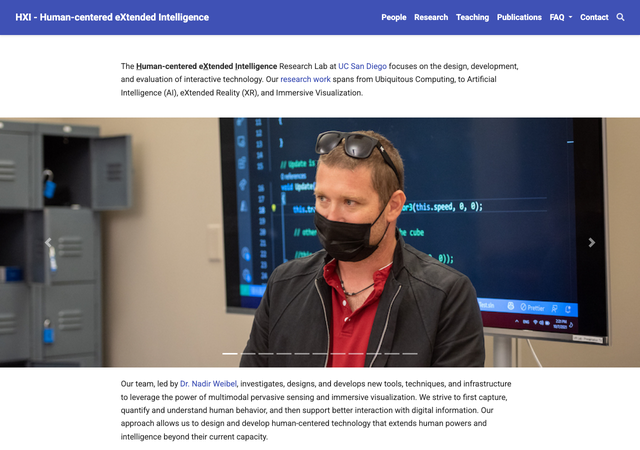
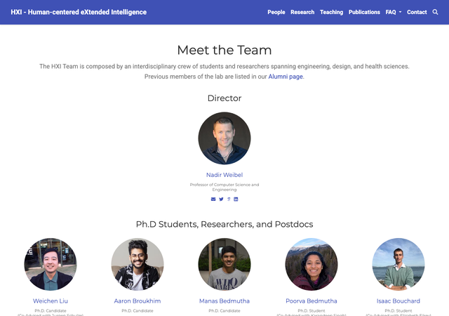
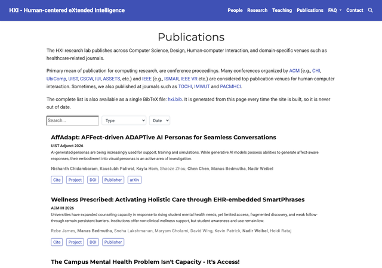
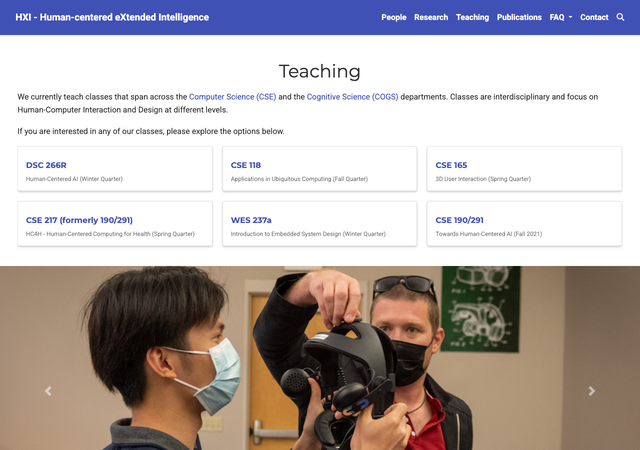
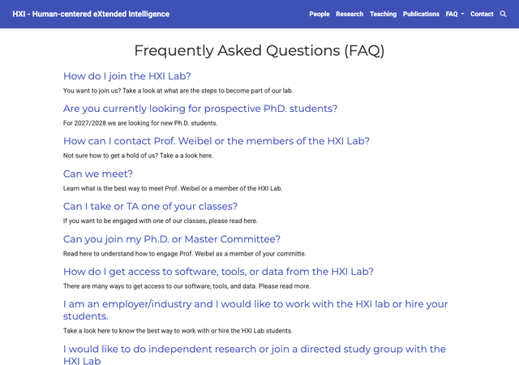
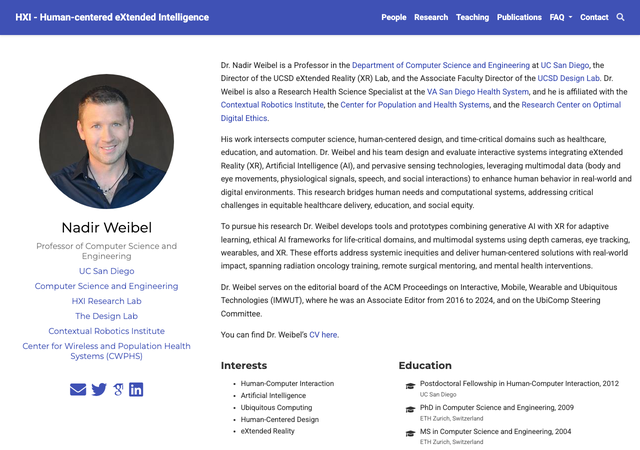

# hxi.ucsd.edu

Source for the website of the **Human-centered eXtended Intelligence (HXI) Research Lab**
at UC San Diego, directed by [Nadir Weibel](https://hxi.ucsd.edu/author/nadir-weibel/).

[](https://app.netlify.com/sites/hxi-ucsd/deploys)

The site is [Hugo](https://gohugo.io) with the Wowchemy Research Group theme, hosted on
Netlify. Everything a visitor sees comes from Markdown files under `content/`. There is no
database and no admin interface, so editing the site means editing text files in this
repository.

## The site, page by page

| | |
|---|---|
| **[Home](https://hxi.ucsd.edu/)**<br><br>What the lab is, a photo slider, the calls to action, partners and funders.<br><br>A stack of widget files in `content/home/`, ordered by `weight`: `welcome.md`, `slider.md`, `intro.md`, `cta.md`, `partners.md`, `support.md`. |  |
| **[Research](https://hxi.ucsd.edu/research/)**<br><br>Every project, split into current and earlier work, with Domain and Technology filters.<br><br>Two portfolio widgets over `content/project/`: `content/research/research.md` and `foundations.md`. A project moves between the sections by gaining or losing the `Earlier` tag. |  |
| **[People](https://hxi.ucsd.edu/people/)**<br><br>Current members, grouped by role.<br><br>`content/people/people.md` over the profile folders in `content/authors/`. The grouping comes from each person's own `user_groups`. |  |
| **[Alumni](https://hxi.ucsd.edu/alumni/)**<br><br>Former members, same layout and different groups.<br><br>`content/alumni/alumni.md`. Their profile folders sit in `content/authors/_alumni/`. |  |
| **[Publications](https://hxi.ucsd.edu/publication/)**<br><br>The full list, newest first, with search and filters.<br><br>One folder per paper in `content/publication/`. `layouts/section/publication.html` sorts preprints after peer-reviewed papers within a year. |  |
| **[Teaching](https://hxi.ucsd.edu/teaching/)**<br><br>The courses the lab teaches.<br><br>One folder per course in `content/course/`. |  |
| **[FAQ](https://hxi.ucsd.edu/faq/)**<br><br>Joining the lab, getting in touch, letters and committee requests.<br><br>One folder per question in `content/faq/`. |  |

And the three page types that make up most of the site:

| | |
|---|---|
| **[A project](https://hxi.ucsd.edu/project/simulated-patients/)**<br><br>Description, images, funders, and a publication list that is generated rather than written: it is every paper whose `projects:` field names this folder.<br><br>`content/project/<slug>/index.md` plus its images. |  |
| **[A publication](https://hxi.ucsd.edu/publication/2025-chidambaram-uist-drivesimquest/)**<br><br>Authors, abstract, venue, and the Cite and DOI buttons. Author names matching a profile become links and render in bold.<br><br>`content/publication/<slug>/index.md` plus `cite.bib`. |  |
| **[A person](https://hxi.ucsd.edu/author/nadir-weibel/)**<br><br>Bio, links, and every paper naming them, collected automatically.<br><br>`content/authors/<name>/_index.md` plus `avatar.jpg`. |  |

## How the site is put together

**A page is a folder, not a file.** Publications, people and projects each get their own
folder holding the text and its images:

```
content/publication/2025-chidambaram-uist-drivesimquest/
    index.md          metadata and abstract
    cite.bib          the BibTeX entry
    featured.jpg      optional, found by filename
```

Hugo picks up `featured.*` and `avatar.*` by name, so you never write an image path. The
folder name becomes the URL, which is why renaming one breaks every link to it.

**Section pages are assembled, not written.** The home page, `/research` and `/people` do
not exist as documents. Each stacks widget files in order of a `weight` value, as listed in
the table above.

**Three fields do the cross-linking**, and each fails silently when wrong:

- `authors:` on a publication. A name that slugifies to a folder in `content/authors/`
  links to that person, puts the paper on their page, and bolds them as a lab member.
- `projects:` on a publication. Names a project folder, which then lists the paper
  automatically. The project page itself needs no edit.
- `categories:` mirrors `projects:` and exists only to drive the "Related" suggestions,
  because Hugo cannot index the `projects` field directly. It is hidden from view.

**Everything else:** `config/_default/` holds the Hugo settings, theme options and
navigation; `assets/` the custom SCSS and the research-page filter JavaScript;
`static/images/` the funder logos; `netlify.toml` the build, redirects and deploy gate.
The theme itself is a Hugo module pinned in `go.mod` and is not in this repository.

## I just want to add a paper or update my profile

You do not need to know Hugo or Markdown. Ask Claude or ChatGPT to do it, using the lab's
packaged helper. Ask Nadir for `hxi-website-claude.zip` (Claude) or `hxi-website-chatgpt.zip`
(ChatGPT, which also works for Gemini and Copilot).

You will need **write access to this repository**. Send Nadir your GitHub username.

The same Claude package installs three ways, and it is one skill, not three:

| Where you work | Install | Reaches the repo via |
|---|---|---|
| claude.ai or the Claude desktop app | Settings, Capabilities, Skills, Upload skill | a GitHub connector you authorize |
| **Claude Code** | `unzip hxi-website-claude.zip -d ~/.claude/skills/` | the `git` already on your machine |
| ChatGPT, Gemini, Copilot | attach `hxi-website-reference.md` from the ChatGPT zip | nothing; it writes the files and you paste them into github.com |

**Claude Code is the one worth having** if you already use it. It is the only route that
can run the site and show you the page before it publishes, because it has a shell. The
browser versions cannot, and should say so rather than implying a change was checked
visually.

If you would rather do it by hand, copy the shape of an existing neighbour rather than
writing a file from scratch. The paths are in the tables above.

## Committing does not publish

The live site is published in batches, not on every commit. Netlify's free tier gives 300
build credits a month and a full rebuild costs about 15, so roughly 20 publishes a month
for the whole lab.

`scripts/netlify-ignore.sh` enforces this. It reads the `DEPLOY_POLICY` environment
variable set in the Netlify UI:

| `DEPLOY_POLICY` | Behaviour |
|---|---|
| unset or `manual` | Nothing publishes unless the commit message contains `[deploy]` |
| `auto` | Everything publishes except commits containing `[skip build]` |

Commit as often as you like; it costs nothing. Your change goes live at the next publish.
**Do not put `[deploy]` in a commit message** unless you are the one releasing the queue,
because it publishes everything anyone else has queued too.

There is a second way to publish that costs no credits at all: building the site locally
and uploading the result, so Netlify never runs a build. That is
`scripts/deploy-manual.sh`, it needs a Netlify token, and the trade-offs and traps are in
[scripts/README-deploy.md](scripts/README-deploy.md). Worth knowing it exists; only whoever
holds the token can run it.

## Seeing your change before it publishes

Because publishing is batched, a commit sits in the repo for a while before it reaches
hxi.ucsd.edu. There is no preview on the hosting side either: Netlify's pull-request
previews run through the same gate as production, so opening a PR does not build you one.
That leaves two routes.

**Have the assistant read the file back.** Quick, needs nothing installed, and it is what
the packaged skill does after every commit: it re-reads what it wrote and checks it against
the conventions that fail silently, such as the group string on a profile or the project
slug on a paper. This catches most mistakes, but it is not a picture of the page. A chat
assistant in a browser has no shell, so it genuinely cannot render the site; if one offers
to, it is wrong.

**Run the site yourself.** The only way to actually look at the page:

```bash
git clone https://github.com/WeibelLab/hxi-website.git
cd hxi-website
hugo server
```

Then open http://localhost:1313. In Claude Code, which does have a shell, you can ask
Claude to do this for you and it will start the preview and check the page.

Hugo must be the **extended** build, version 0.89.2, the version Netlify uses. Newer
versions break this theme's pinned modules, so `brew install hugo` will not work. Get it
from [the v0.89.2 release page](https://github.com/gohugoio/hugo/releases/tag/v0.89.2).

Two things that otherwise waste an afternoon:

- **Restart the server** after changing anything in `config/`, `static/`, `assets/js/` or
  `layouts/`, and after renaming a folder. Live reload misses those and quietly serves
  stale content, which looks exactly like your change not working.
- **A clean build is not proof.** A wrong `user_groups` value or a nonexistent project slug
  builds without complaint and simply omits your content. Open the page and look for it.

## Conventions that matter

These are the ones that fail *silently*, producing a clean build with your content missing:

- **`user_groups` must match one of the strings the people widget lists.** `Ph.D` has one period and
  `Master` is singular. A value not on that list removes the person from `/people` with no
  error. Copy it from an existing profile rather than retyping it.
- **`projects:` values are project folder names.** A slug that does not exist just does
  nothing.
- **Spell out every author**, in paper order, never "et al.". A misspelled name silently
  costs that person the credit.
- **Nothing under review goes on the site** unless it is already on arXiv.
- Future dates are fine. The site builds with `buildFuture`, so an accepted paper can
  carry its real conference date.

## Old URLs

Renaming a project folder changes its URL and breaks every link anyone already has. Keep
the old URL working by listing it as an alias on the page that should now receive the
traffic. Rename `willo` to `student-wellbeing`, and in
`content/project/student-wellbeing/index.md`:

```yaml
---
aliases:
  - /project/willo/
title: 'Student Mental Health and Well-Being: Research with WILLO'
```

Four things to get right:

- **Leading and trailing slashes, and the section prefix.** `/project/willo/`, not `willo`.
- **Lowercase.** Hugo lowercases every URL, so an alias with capitals never matches.
- **The alias goes on the destination page.** The old folder no longer exists.
- **Never alias a path a real page occupies.** The redirect is forced, so it would shadow
  that page and make it unreachable.

Aliases work the same way on author profiles. `/author/hridy/` sits in
`content/authors/hridyanshu/_index.md`.

Check it with `hugo server` and visit the old URL. Hugo writes a small stub page at every
alias path, which is what makes this testable locally. At build time
`layouts/index.redirects` turns the same front matter into forced 301s in `public/_redirects`,
and that is what production serves. The stub and the 301 land on the same page.

`netlify.toml` holds the redirects that have no page to live in: wildcards, off-site
destinations such as `/join`, and rewrites that keep the URL bar unchanged such as `/weibel`.

## Bibliography

The full publication list is exported as BibTeX at
[hxi.ucsd.edu/hxi.bib](https://hxi.ucsd.edu/hxi.bib), generated at build time from each
publication's own `cite.bib`. There is no hand-maintained master `.bib` file, deliberately:
the previous one silently went stale for four years.

## Layout overrides

Everything in `layouts/` overrides the theme. Keep this list short.

| File | Why |
|---|---|
| `layouts/section/publication.html` | Sorts preprints last within each year |
| `layouts/authors/list.html` | Groups people by `user_groups` on `/people` and `/alumni` |
| `layouts/partials/widgets/portfolio.html` | Adds `exclude_tags` and two-axis filtering on `/research` |
| `layouts/index.bib` | Generates the combined BibTeX export |
| `layouts/_default/_markup/render-link.html` | Sends external links to one shared tab instead of a new tab each |
| `layouts/index.redirects` | Compiles page `aliases:` into forced 301s in `_redirects` |

External links open in a single shared tab named `hxi-external`, rather than a new tab
per click. The render hook above covers links written in content;
`assets/js/external-links.js` covers the ones theme templates generate, such as DOI and
publication buttons.

Screenshots in `docs/screenshots/` are used only by this README.

## Code of conduct

See [CODE_OF_CONDUCT.md](CODE_OF_CONDUCT.md). Report concerns to hxi@ucsd.edu.
