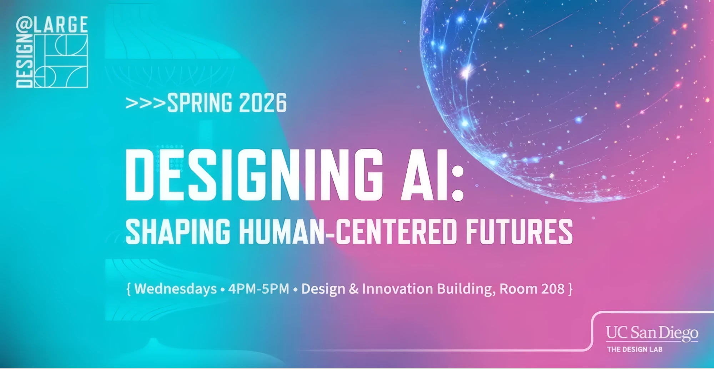

# Design@Large

### What is Design@Large?
Design@Large is a course and public speaker series that brings the [Design Lab](https://designlab.ucsd.edu/)'s mission and work into real-world contexts. The series explores what design looks like across sectors, domains, and topics, with each session focusing on concrete work and the questions behind it. Participants are invited into a dialogue about how design contributes to addressing societal challenges, cultural shifts, and technological change.

Speakers and participants include students, researchers, civic partners, business leaders, community practitioners, and colleagues from global design and innovation networks. Together we look closely at what the real work behind innovation and impact looks like, and what it means to do that work.

The series is open to the broader public and livestreamed online, while also serving as a core seminar for over 100 undergraduate and graduate students at UC San Diego.

### How the series works
Each week brings together a guest speaker, a faculty discussant, and a Ph.D. student discussant in a structured conversation. Sessions are designed to move past technical overviews and into the harder questions.

- **Guest talks** from a researcher, practitioner, or designer whose work engages the session's theme
- **Faculty and student discussion** following the talk, with brief responses that open the conversation out
- **Audience participation**, in the room and online

### Spring 2026: Designing AI, Shaping Human-Centered Futures
Artificial intelligence is no longer confined to research labs or technical infrastructure. It is embedded in classrooms, creative practice, healthcare systems, communication platforms, and planetary-scale infrastructures. As AI systems move from experimental tools to everyday companions, decision-makers, and mediators of social life, the question is no longer whether AI will shape our future, but how, and by whom.

At the Design Lab we approach AI as a fundamentally human-centered design challenge rather than simply an algorithmic achievement. Intelligent systems must be technically robust yet responsive to lived experience, powerful at scale yet grounded in context, innovative yet attentive to equity and responsibility.

The Spring 2026 series brought together voices from research, industry, education, law, health, and the arts to examine how AI is designed, deployed, governed, and experienced in real-world settings: generative AI in education and music, embodied intelligence in XR, disability justice and communication, sustainable computing, Indigenous data sovereignty, personal AI companions, and value-based care in health systems.

Rather than treating AI as a purely technical system, the series frames it as a site of negotiation among human values, institutional incentives, cultural norms, and material conditions, and asks how design decisions shape agency, creativity, trust, access, and care at scale.

### More information
Schedule and past sessions: [designlab.ucsd.edu/education/design-at-large](https://designlab.ucsd.edu/education/design-at-large)
