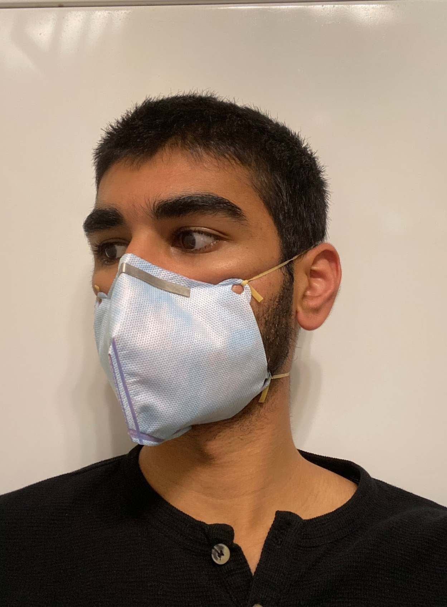

------
​
### Overview
​
These projects created N95 half masks that were manufactured and donated to hospitals in the San Diego - Tijuana region. The masks' filtration abilities were tested and instructions made for the DIY creation of these masks. Check out the instructions and extra info for detailed testing results, materials, tips, and more.

    

        
Silicone Mask

        <a href="https://github.com/WeibelLab/SiliconeHalfMask/wiki"><b>More Info + Instructions</b></a>
        
        

        This is a silicone mask. The silicone allows for a much better seal around the face, allows for resuablitiy, replaceable filters, and easy cleaning.
        

        

        To make the mask, a mold is 3D printed. 2 part silicone (available in popular hardware stores) is poured into the mold and allowed to set. Once set, the silicone is removed, trimmed, and is ready to go. The mold can be re-used an infinite number of times and shared with others.
        

    

    

        
Triton Mask

        <a href="https://github.com/WeibelLab/Triton-Mask/wiki"><b>More Info + Instructions</b></a>
        
        

        This is a polypropelene mask similar to the everyday N95 and surgical masks people wear. It is extremely cheap and easy to manufacture on both individual and massive scales, with a metal nose piece to make the mask form to the face.
        

        

        To make the mask, cut or laser cut the form from a polypropelene or fabric sheet (dimmensions can be found in <a href="https://github.com/WeibelLab/Triton-Mask/wiki">More Info</a>). Cut the aluminum strip to size, use a hair straightener, bag sealer, or other hot device to melt the mask edges and nose piece into place. You now have a mask!
        

    

