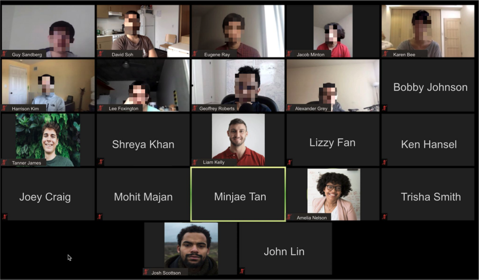
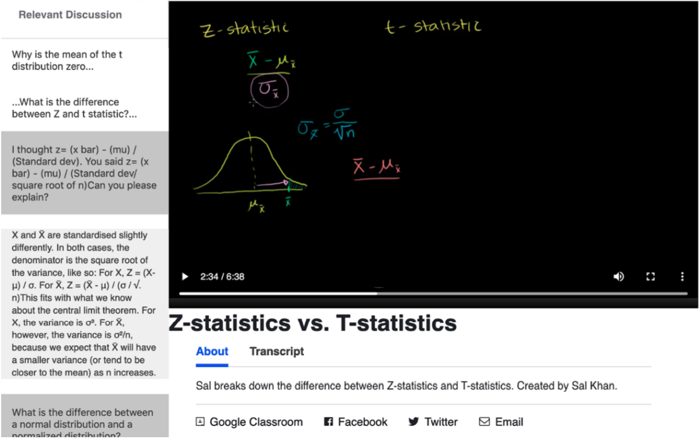

 
------
### Overview
Online learners frequently encounter uncertainity (e.g., confusion) during their study sessions. Unlike in-person educational settings in which learners can conveniently access support from instructors, online students are usually left to address uncertainty on their own. Suboptimal methods of resolving uncertainty (e.g., navigating the sea of information on the web or asking questions in discussion fora with delayed responses) can lead to learning inefficiency, frustration, and lack of productivity.

In this line of works, we first identify and contextualize the breakdowns of remote learning in different settings, such as formal undergraduate education, MOOC (Massive Open Online Courses) users, and healthcare training. We then aim to improve remote learning by leveraging minimally-invasive user context and providing timely AI and peer support. 

 
 

  

Our works in this space are well-recognized in the media: <a href="https://ucsdnews.ucsd.edu/feature/it-feels-like-im-talking-into-a-void-how-do-we-improve-the-virtual-classroom">UC San Diego News Center</a>, <a href="https://technews.acm.org/archives.cfm?fo=2021-06-jun/jun-14-2021.html">ACM TechNews</a>, <a href="https://www.engineering.com/story/student-research-aims-to-improve-nonverbal-communication-in-virtual-classrooms">Engineering.com</a>, <a href="https://csealumnimagazine.ucsd.edu/the-ongoing-pandemic-challenge">CSE Alumni Magazine</a>  

------

### Funding and External Collaborations

This project is a collaboration between Computer Science and Engineering (CSE) and Cognitive Science (COGS) departments at UC San Diego and Carnegie Mellon University.

### Publications




